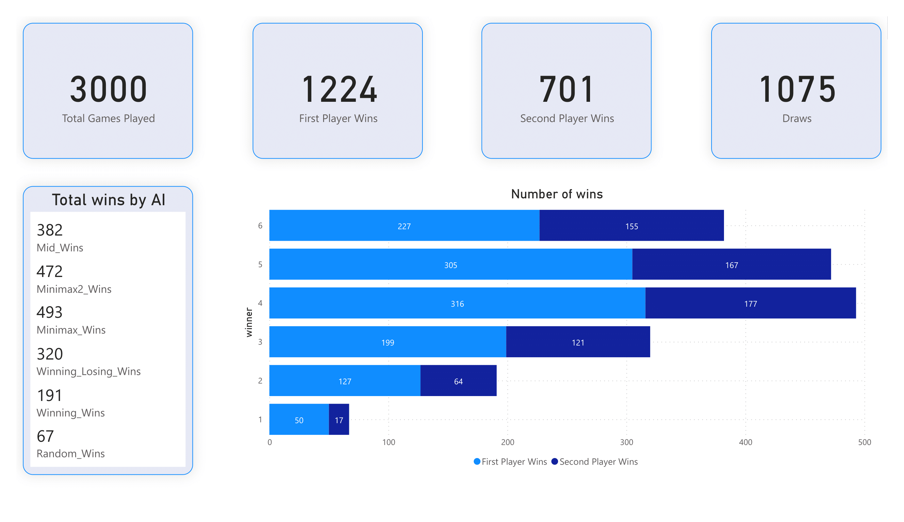

# Tic-Tac-Toe in Python

Author : Arthur Launoy <arthur.launoy88@gmail.com>

## SUMMARY

Simple TicTacToe command-line game with added AIs playing the game. The idea behind this project came from reading this excellent post from Robert Heaton, available [here](https://robertheaton.com/2018/10/09/programming-projects-for-advanced-beginners-3-a/.). 

The other parts (database, data visualization, tests, ...) came from my own imagination.

## USAGE

To play against the computer, enter the following command in the terminal :
```bash
$ python main.py
```

More instructions will be prompted on the command line.

To pit the AIs against one another, enter the following command :
```bash
$ python main.py battles [num] [ai1] [ai2]
```

This will launch *num* games pitting *ai1* and *ai2* against each other. The AI *ai1* will always play first. Adding save at the end of this line saves the result of the battles to the database.

## TESTS

If you want to run the test suite, go to the root of the project and enter the following command:

```bash
$ python -m pytest tests
```

## DATABASE

As written above, it is possible to save the results of the repeated battles to a database. 

If you want to do so on your own computer, you must follow a few steps to get it all working properly.

First, make sure you have postgresql installed with a version >= 15.2

Then, move the file [template](/db/database_template.ini) to the root of the project, rename it "database.ini"
and fill out all the information in the file.

Lastly, run the [init](/db/init.sql) script, which will create two tables and populate them. These tables are necessary for the program to save data to the database, make sure you don't lose them.

Once all of this is done, you can use the save command, as described in the [Usage](#usage) section.

## STATISTICS

After running the *battles* option a good number of times, we can obtain statistics on 
our game of TicTacToe. Here are mine, visualized using Microsoft's tool, Power BI.

<p align="center">
	</img>
</p>